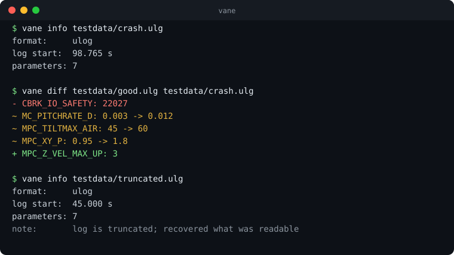

<div align="center">

# flightdiff

**Fast forensics for UAV flight logs.**

[](https://github.com/Shuaibu78/flightdiff/actions/workflows/ci.yml)
[](https://crates.io/crates/flightdiff)
[](#license)

</div>

<!-- Record with asciinema, host the SVG in docs/. This GIF is the single most
     important asset in the repo. Put it above the fold, before any prose. -->


```
$ flightdiff diff testdata/good.ulg testdata/crash.ulg
- CBRK_IO_SAFETY: 22027
~ MC_PITCHRATE_D: 0.003 -> 0.012
~ MPC_TILTMAX_AIR: 45 -> 60
~ MPC_XY_P: 0.95 -> 1.8
+ MPC_Z_VEL_MAX_UP: 3
```

## Why

Working out why a drone fell out of the sky currently means uploading a log to
someone else's server, or installing a Qt stack, or piping `mavlogdump.py`
through `grep`. `flightdiff` is one binary, runs offline, and opens a 500 MB log
faster than the alternatives finish importing.

| | flightdiff | Flight Review | pyFlightAnalysis |
| --- | --- | --- | --- |
| 500 MB ULog, cold | *TODO* | *TODO* | *TODO* |
| Dependencies | none | Python + Bokeh | PyQt + numpy + matplotlib |
| Works offline | yes | self-host required | yes |
| Reads truncated logs | yes | partial | no |

<!-- Fill the TODOs from `cargo bench` before you announce anything. An
     unbenchmarked speed claim is the fastest way to lose credibility here. -->

## Install

```sh
cargo install flightdiff
```

## Usage

```sh
flightdiff info flight.ulg           # what is this log
flightdiff diff before.ulg after.ulg # what changed
```

## Supported formats

| Format | Status |
| --- | --- |
| PX4 ULog (`.ulg`) | in progress |
| ArduPilot DataFlash (`.bin`) | in progress |
| Betaflight blackbox | planned |

## Using the parser as a library

The parsing lives in `flightdiff-core` and is published separately, so you can build
your own tooling on it without taking the CLI.

```rust,no_run
let log = flightdiff_core::open("flight.ulg")?;
for (name, value) in log.params() {
    println!("{name} = {value}");
}
# Ok::<(), flightdiff_core::Error>(())
```

## Contributing

See [CONTRIBUTING.md](CONTRIBUTING.md). Issues tagged
[`good first issue`](https://github.com/Shuaibu78/flightdiff/labels/good%20first%20issue)
are a reasonable entry point.

## License

Dual licensed under either of

- Apache License, Version 2.0 ([LICENSE-APACHE](LICENSE-APACHE))
- MIT license ([LICENSE-MIT](LICENSE-MIT))

at your option. Unless you state otherwise, any contribution you intentionally
submit for inclusion shall be dual licensed as above, without additional terms.
